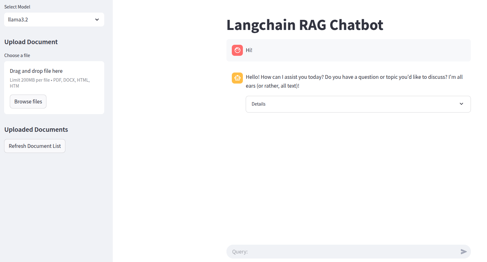

# RAG Project Example

This repository contains an example of building a simple Retrieval-Augmented Generation (RAG) application using FastAPI and LangChain. The project was developed as part of a university lecture at [BSUIR](https://www.bsuir.by/) and demonstrates the step-by-step creation of a RAG system.

The project is based on an example described in [this article](https://blog.futuresmart.ai/building-a-production-ready-rag-chatbot-with-fastapi-and-langchain) and has been adapted to work with Llama3.2 and to demonstrate the incremental creation of the application.

I would like to express my sincere gratitude to the author of the article!

## 📌 About the Project

- **Technologies**: FastAPI, LangChain, Llama3.2, OpenAI API, ChromaDB, SQLite, Streamlit
- **Architecture**: 
- **Key Features**:
  - 💬 Interactive chat interface
  - 📚 Document upload and processing
  - 🔍 Context-aware responses using RAG
  - 🗄️ Use of SQLite and Chroma databases for persistent data storage
  - 📝 Chat history tracking
  - 🔒 Session management



## 🚀 How to Use

### 1. Clone the repository

```bash
git clone https://github.com/KovalM/rag-fastapi-project.git
cd rag-fastapi-project
```

### 2. Create a virtual environment and install dependencies

```bash
python -m venv venv
source venv/bin/activate  # For Linux/Mac
venv\Scripts\activate    # For Windows
# Installing dependencies may take up to 8 GB of disk space
pip install -r requirements.txt
```

### 3. Install and run Llama3.2 via Ollama

```bash
curl -fsSL https://ollama.com/install.sh | sh  # Install Ollama (Linux/Mac)
powershell -Command "irm https://ollama.com/install.ps1 | iex"  # Install Ollama (Windows)
ollama pull llama3.2  # Download the model
```

You can read more about installing Ollama here: [Ollama Download](https://ollama.com/download)

### 4. Run the FastAPI server

```bash
cd api
uvicorn main:app --reload
```

The API will be available at `http://127.0.0.1:8000`.

API documentation: `http://127.0.0.1:8000/docs`.

### 5. Run the Streamlit app

```bash
cd app
streamlit run streamlit_app.py
```

The Streamlit interface will be available in your browser at `http://localhost:8501`.

## 🔍 Step-by-Step Learning

You can explore the process of developing the RAG application by reviewing the [commit history](https://github.com/KovalM/rag-fastapi-project/compare/6d7ca7e975a8527874acea1ee9cb6bb9cc07cc75...ef257e34a8ab48ab89edd466bb60b7a9e95b4bb7). Each commit represents a logically complete stage of work.

## 📄 Presentation

A detailed explanation of the project is available in the [presentation](https://docs.google.com/presentation/d/1U23dg7WyAt6UQCZWpEbRMGbDmqfyWyx37K4Xmd6SzCc/edit#slide=id.SLIDES_API1100702386_709).

## 🤝 Contacts

If you have any questions or suggestions, please reach out via Issues or create a Pull Request!

- Telegram: [@KovalM_tg](https://t.me/KovalM_tg)

- Email: [michail.kovalev7@gmail.com](mailto:michail.kovalev7@gmail.com)
